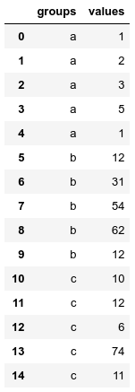
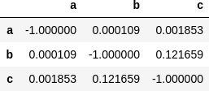

===============
scikit-posthocs
===============

.. image:: https://travis-ci.org/maximtrp/scikit-posthocs.svg?branch=master
    :target: https://travis-ci.org/maximtrp/scikit-posthocs
.. image:: https://img.shields.io/github/issues/maximtrp/scikit-posthocs.svg
    :target: https://github.com/maximtrp/scikit-posthocs/issues
.. image:: https://img.shields.io/pypi/v/scikit-posthocs.svg
    :target: https://pypi.python.org/pypi/scikit-posthocs/

This Python package provides statistical post-hoc tests for pairwise multiple comparisons
and outlier detection algorithms.

Features
--------

- Multiple comparisons parametric and nonparametric tests (some are ported from R's
  `PMCMR <https://cran.r-project.org/web/packages/PMCMR/index.html>`_ package):

  - Conover, Dunn, and Nemenyi tests for use with Kruskal-Wallis test.
  - Conover, Nemenyi, and Siegel tests for use with Friedman test.
  - Quade, van Waerden, and Durbin tests.
  - Student, Mann-Whitney, Wilcoxon, and TukeyHSD tests.
  - Anderson-Darling test.

  All tests are capable of p adjustments for multiple pairwise comparisons.

- Plotting functionality (e.g. significance plots).

- Outlier detection algorithms:

  - Simple test based on interquartile range (IQR).
  - Grubbs test.
  - Tietjen-Moore test.
  - Generalized Extreme Studentized Deviate test (ESD test).

Dependencies
------------

- `NumPy and SciPy packages <https://www.scipy.org/>`_
- `Statsmodels <http://statsmodels.sourceforge.net/>`_
- `Pandas <http://pandas.pydata.org/>`_
- `Matplotlib <https://matplotlib.org/>`_
- `Seaborn <https://seaborn.pydata.org/>`_

Compatibility
-------------

Package is compatible with Python 2 and Python 3.

Install
-------

You can install the package with:
``pip install scikit-posthocs``

Examples
--------

List or NumPy array
~~~~~~~~~~~~~~~~~~~

.. code:: python

  import scikit_posthocs as sp
  x = [[1,2,3,5,1], [12,31,54], [10,12,6,74,11]]
  sp.posthoc_conover(x, p_adjust = 'holm')

::

  array([[-1.        ,  0.00119517,  0.00278329],
         [ 0.00119517, -1.        ,  0.18672227],
         [ 0.00278329,  0.18672227, -1.        ]])

Pandas DataFrame
~~~~~~~~~~~~~~~~

Columns specified with ``val_col`` and ``group_col`` args must be melted prior to making comparisons.

.. code:: python

  import scikit_posthocs as sp
  import pandas as pd
  x = pd.DataFrame({"a": [1,2,3,5,1], "b": [12,31,54,62,12], "c": [10,12,6,74,11]})
  x = x.melt(var_name='groups', value_name='values')

.. code:: python

  sp.posthoc_conover(x, val_col='values', group_col='groups')

Significance plots
~~~~~~~~~~~~~~~~~~

P values can be plotted using a heatmap:

.. code:: python

  pc = sp.posthoc_conover(x, val_col='values', group_col='groups')
  heatmap_args = {'linewidths': 0.25, 'linecolor': '0.5', 'clip_on': False, 'square': True, 'cbar_ax_bbox': [0.80, 0.35, 0.04, 0.3]}
  sp.sign_plot(pc, **heatmap_args)

.. image:: images/plot-conover.png

Custom colormap applied to a plot:

.. code:: python

  pc = sp.posthoc_conover(x, val_col='values', group_col='groups')
  # Format: diagonal, non-significant, p<0.001, p<0.01, p<0.05
  cmap = ['1', '#fb6a4a',  '#08306b',  '#4292c6', '#c6dbef']
  heatmap_args = {'cmap': cmap, 'linewidths': 0.25, 'linecolor': '0.5', 'clip_on': False, 'square': True, 'cbar_ax_bbox': [0.80, 0.35, 0.04, 0.3]}
  sp.sign_plot(pc, **heatmap_args)

.. image:: images/plot-conover-custom-cmap.png

Credits
-------

Thorsten Pohlert, PMCMR author and maintainer
