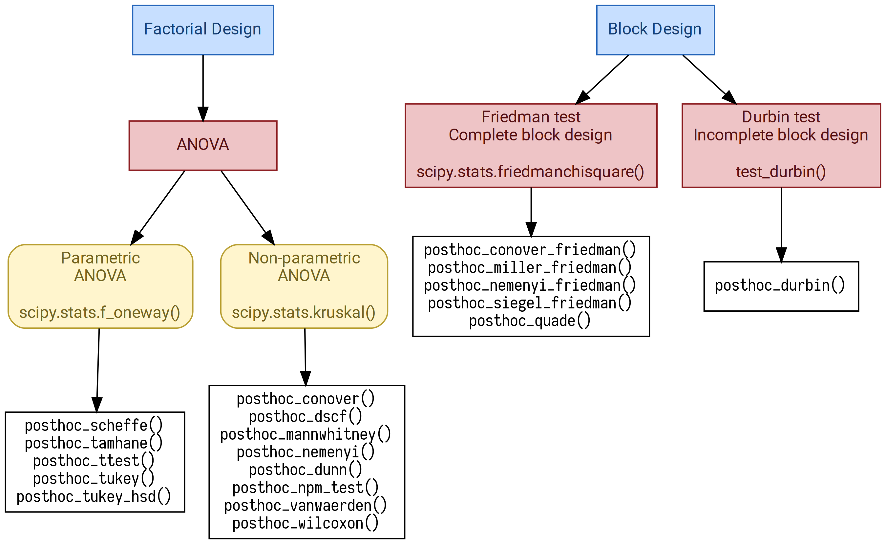
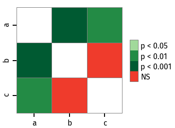

===============

.. image:: https://travis-ci.org/maximtrp/scikit-posthocs.svg?branch=master
    :target: https://travis-ci.org/maximtrp/scikit-posthocs
.. image:: https://img.shields.io/readthedocs/scikit-posthocs.svg
    :target: https://scikit-posthocs.readthedocs.io
.. image:: http://joss.theoj.org/papers/10.21105/joss.01169/status.svg
    :target: https://doi.org/10.21105/joss.01169
.. image:: https://codecov.io/gh/maximtrp/scikit-posthocs/branch/master/graph/badge.svg
    :target: https://codecov.io/gh/maximtrp/scikit-posthocs
.. image:: https://api.codacy.com/project/badge/Grade/e172fecdc82d43a7b025527a3a7088e1
    :target: https://www.codacy.com/app/maximtrp/scikit-posthocs?utm_source=github.com&amp;utm_medium=referral&amp;utm_content=maximtrp/scikit-posthocs&amp;utm_campaign=Badge_Grade
.. image:: https://pepy.tech/badge/scikit-posthocs
    :target: https://pepy.tech/project/scikit-posthocs
.. image:: https://img.shields.io/github/issues/maximtrp/scikit-posthocs.svg
    :target: https://github.com/maximtrp/scikit-posthocs/issues
.. image:: https://img.shields.io/pypi/v/scikit-posthocs.svg
    :target: https://pypi.python.org/pypi/scikit-posthocs/

**scikit-posthocs** is a Python package which provides post hoc tests for pairwise multiple comparisons that are usually performed in statistical data analysis to assess the differences between group levels if a statistically significant result of ANOVA test has been obtained.

**scikit-posthocs** is tightly integrated with Pandas DataFrames and NumPy arrays to ensure fast computations and convenient data import and storage.

This package will be useful for statisticians, data analysts, and researchers who use Python in their work.

Background
----------

Python statistical ecosystem is comprised of multiple packages. However, it still has numerous gaps and is surpassed by R packages and capabilities.

`SciPy <https://www.scipy.org/>`_ (version 1.2.0) offers *Student*, *Wilcoxon*, and *Mann-Whitney* tests which are not adapted to multiple pairwise comparisons. `Statsmodels <http://statsmodels.sourceforge.net/>`_ (version 0.9.0) features *TukeyHSD* test which needs some extra actions to be fluently integrated into a data analysis pipeline. `Statsmodels <http://statsmodels.sourceforge.net/>`_ also has good helper methods: ``allpairtest`` (adapts an external function such as ``scipy.stats.ttest_ind`` to multiple pairwise comparisons) and ``multipletests`` (adjusts *p* values to minimize type I and II errors). `PMCMRplus <https://rdrr.io/cran/PMCMRplus/>`_ is a very good R package which has no rivals in Python as it offers more than 40 various tests (including post hoc tests) for factorial and block design data. PMCMRplus was an inspiration and a reference for *scikit-posthocs*.

**scikit-posthocs** attempts to improve Python statistical capabilities by offering a lot of parametric and nonparametric post hoc tests along with outliers detection and basic plotting methods.

Features
--------

- *Omnibox* tests:

  - Durbin test (for BIBD).

- *Parametric* pairwise multiple comparisons tests:

  - Scheffe test.
  - Student T test.
  - Tamhane T2 test.
  - TukeyHSD test.

- *Non-parametric* tests for factorial design:

  - Conover test.
  - Dunn test.
  - Dwass, Steel, Critchlow, and Fligner test.
  - Mann-Whitney test.
  - Nashimoto and Wright (NPM) test.
  - Nemenyi test.
  - van Waerden test.
  - Wilcoxon test.

- *Non-parametric* tests for block design:

  - Conover test.
  - Durbin and Conover test.
  - Miller test.
  - Nemenyi test.
  - Quade test.
  - Siegel test.

- Other tests:

  - Anderson-Darling test.
  - Mack-Wolfe test.
  - Hayter (OSRT) test.

- Outliers detection tests:

  - Simple test based on interquartile range (IQR).
  - Grubbs test.
  - Tietjen-Moore test.
  - Generalized Extreme Studentized Deviate test (ESD test).

- Plotting functionality (e.g. significance plots).

All post hoc tests are capable of p adjustments for multiple pairwise comparisons.

Dependencies
------------

- `NumPy and SciPy packages <https://www.scipy.org/>`_
- `Statsmodels <http://statsmodels.sourceforge.net/>`_
- `Pandas <http://pandas.pydata.org/>`_
- `Matplotlib <https://matplotlib.org/>`_
- `Seaborn <https://seaborn.pydata.org/>`_

Compatibility
-------------

Package is compatible with Python 2 and Python 3.

Install
-------

You can install the package from PyPi:

.. code:: bash

  $ pip install scikit-posthocs

Examples
--------

Parametric ANOVA with post hoc tests
~~~~~~~~~~~~~~~~~~~~~~~~~~~~~~~~~~~~

Here is a simple example of the one-way analysis of variance (ANOVA) with post hoc tests used to compare *sepal width* means of three groups (three iris species) in *iris* dataset.

To begin, we will import the dataset using statsmodels ``get_rdataset()`` method.

.. code:: python

  >>> import statsmodels.api as sa
  >>> import statsmodels.formula.api as sfa
  >>> import scikit_posthocs as sp
  >>> df = sa.datasets.get_rdataset('iris').data
  >>> df.head()
     Sepal.Length  Sepal.Width  Petal.Length  Petal.Width Species
  0           5.1          3.5           1.4          0.2  setosa
  1           4.9          3.0           1.4          0.2  setosa
  2           4.7          3.2           1.3          0.2  setosa
  3           4.6          3.1           1.5          0.2  setosa
  4           5.0          3.6           1.4          0.2  setosa

Now, we will build a model and run ANOVA using statsmodels ``ols()`` and ``anova_lm()`` methods. Columns ``Species`` and ``Sepal.Width`` contain independent (predictor) and dependent (response) variable values, correspondingly.

.. code:: python

  >>> lm = sfa.ols('Sepal.Width ~ C(Species)', data=df).fit()
  >>> anova = sa.stats.anova_lm(lm)
  >>> print(anova)
                 df     sum_sq   mean_sq         F        PR(>F)
  C(Species)    2.0  11.344933  5.672467  49.16004  4.492017e-17
  Residual    147.0  16.962000  0.115388       NaN           NaN

The results tell us that there is a significant difference between groups means (p = 4.49e-17), but does not tell us the exact group pairs which are different in means. To obtain pairwise group differences, we will carry out a posteriori (post hoc) analysis using ``scikits-posthocs`` package. Student T test applied pairwisely gives us the following p values:

.. code:: python

  >>> sp.posthoc_ttest(df, val_col='Sepal.Width', group_col='Species', p_adjust='holm')
                    setosa    versicolor     virginica
  setosa     -1.000000e+00  5.535780e-15  8.492711e-09
  versicolor  5.535780e-15 -1.000000e+00  1.819100e-03
  virginica   8.492711e-09  1.819100e-03 -1.000000e+00

Remember to use a `FWER controlling procedure <https://en.wikipedia.org/wiki/Family-wise_error_rate#Controlling_procedures>`_, such as Holm procedure, when making multiple comparisons. As seen from this table, significant differences in group means are obtained for all group pairs.

Non-parametric ANOVA with post hoc tests
~~~~~~~~~~~~~~~~~~~~~~~~~~~~~~~~~~~~~~~

If normality and other `assumptions <https://en.wikipedia.org/wiki/One-way_analysis_of_variance>`_ are violated, one can use a non-parametric Kruskal-Wallis H test (one-way non-parametric ANOVA) to test if samples came from the same distribution.

Let's use the same dataset just to demonstrate the procedure. Kruskal-Wallis test is implemented in SciPy package. ``scipy.stats.kruskal`` method accepts array-like structures, but not DataFrames.

.. code:: python

  >>> import scipy.stats as ss
  >>> import statsmodels.api as sa
  >>> import scikit_posthocs as sp
  >>> df = sa.datasets.get_rdataset('iris').data
  >>> data = [df.loc[ids, 'Sepal.Width'].values for ids in df.groupby('Species').groups.values()]

``data`` is a list of 1D arrays containing *sepal width* values, one array per each species. Now we can run Kruskal-Wallis analysis of variance.

.. code:: python

  >>> H, p = ss.kruskal(*data)
  >>> p
  1.5692820940316782e-14

P value tells us we may reject the null hypothesis that the population medians of all of the groups are equal. To learn what groups (species) differ in their medians we need to run post hoc tests. ``scikit-posthocs`` provides a lot of non-parametric tests mentioned above. Let's choose Conover's test.

.. code:: python

  >>> sp.posthoc_conover(df, val_col='Sepal.Width', group_col='Species', p_adjust = 'holm')
                    setosa    versicolor     virginica
  setosa     -1.000000e+00  2.278515e-18  1.293888e-10
  versicolor  2.278515e-18 -1.000000e+00  1.881294e-03
  virginica   1.293888e-10  1.881294e-03 -1.000000e+00

Pairwise comparisons show that we may reject the null hypothesis (p < 0.01) for each pair of species and conclude that all groups (species) differ in their sepal widths.

Block design
~~~~~~~~~~~~

In block design case, we have a primary factor (e.g. treatment) and a blocking factor (e.g. age or gender). A blocking factor is also called a *nuisance* factor, and it is usually a source of variability that needs to be accounted for.

An example scenario is testing the effect of four fertilizers on crop yield in four cornfields. We can represent the results with a matrix in which rows correspond to the blocking factor (field) and columns correspond to the primary factor (yield).

The following dataset is artificial and created just for demonstration of the procedure:

.. code:: python

  >>> data = np.array([[ 8.82, 11.8 , 10.37, 12.08],
                       [ 8.92,  9.58, 10.59, 11.89],
                       [ 8.27, 11.46, 10.24, 11.6 ],
                       [ 8.83, 13.25,  8.33, 11.51]])

First, we need to perform an omnibus test — Friedman rank sum test. It is implemented in ``scipy.stats`` subpackage:

.. code:: python

  >>> import scipy.stats as ss
  >>> ss.friedmanchisquare(*data.T)
  FriedmanchisquareResult(statistic=8.700000000000003, pvalue=0.03355726870553798)

We can reject the null hypothesis that our treatments have the same distribution, because p value is less than 0.05. A number of post hoc tests are available in ``scikit-posthocs`` package for unreplicated block design data. In the following example, Nemenyi's test is used:

.. code:: python

  >>> import scikit_posthocs as sp
  >>> sp.posthoc_nemenyi_friedman(data)
            0         1         2         3
  0 -1.000000  0.220908  0.823993  0.031375
  1  0.220908 -1.000000  0.670273  0.823993
  2  0.823993  0.670273 -1.000000  0.220908
  3  0.031375  0.823993  0.220908 -1.000000

This function returns a DataFrame with p values obtained in pairwise comparisons between all treatments.
One can also pass a DataFrame and specify the names of columns containing dependent variable values, blocking and primary factor values. The following code creates a DataFrame with the same data:

.. code:: python

  >>> data = pd.DataFrame.from_dict({'blocks': {0: 0, 1: 1, 2: 2, 3: 3, 4: 0, 5: 1, 6:
  2, 7: 3, 8: 0, 9: 1, 10: 2, 11: 3, 12: 0, 13: 1, 14: 2, 15: 3}, 'groups': {0:
  0, 1: 0, 2: 0, 3: 0, 4: 1, 5: 1, 6: 1, 7: 1, 8: 2, 9: 2, 10: 2, 11: 2, 12: 3,
  13: 3, 14: 3, 15: 3}, 'y': {0: 8.82, 1: 8.92, 2: 8.27, 3: 8.83, 4: 11.8, 5:
  9.58, 6: 11.46, 7: 13.25, 8: 10.37, 9: 10.59, 10: 10.24, 11: 8.33, 12: 12.08,
  13: 11.89, 14: 11.6, 15: 11.51}})
  >>> data
      blocks  groups      y
  0        0       0   8.82
  1        1       0   8.92
  2        2       0   8.27
  3        3       0   8.83
  4        0       1  11.80
  5        1       1   9.58
  6        2       1  11.46
  7        3       1  13.25
  8        0       2  10.37
  9        1       2  10.59
  10       2       2  10.24
  11       3       2   8.33
  12       0       3  12.08
  13       1       3  11.89
  14       2       3  11.60
  15       3       3  11.51

This is a *melted* and ready-to-use DataFrame. Do not forget to pass ``melted`` argument:

.. code:: python

  >>> sp.posthoc_nemenyi_friedman(x, y_col='y', block_col='blocks', group_col='groups', melted=True)
            0         1         2         3
  0 -1.000000  0.220908  0.823993  0.031375
  1  0.220908 -1.000000  0.670273  0.823993
  2  0.823993  0.670273 -1.000000  0.220908
  3  0.031375  0.823993  0.220908 -1.000000

Data types
~~~~~~~~~~

Internally, ``scikit-posthocs`` uses NumPy ndarrays and pandas DataFrames to store and process data. Python lists, NumPy ndarrays, and pandas DataFrames are supported as *input* data types. Below are usage examples of various input data structures.

Lists and arrays
^^^^^^^^^^^^^^^^

.. code:: python

  >>> x = [[1,2,1,3,1,4], [12,3,11,9,3,8,1], [10,22,12,9,8,3]]
  >>> # or
  >>> x = np.array([[1,2,1,3,1,4], [12,3,11,9,3,8,1], [10,22,12,9,8,3]])
  >>> sp.posthoc_conover(x, p_adjust='holm')
            1         2         3
  1 -1.000000  0.057606  0.007888
  2  0.057606 -1.000000  0.215761
  3  0.007888  0.215761 -1.000000

You can check how it is processed with a hidden function ``__convert_to_df()``:

.. code:: python

  >>> sp.__convert_to_df(x)
  (    vals  groups
   0      1       1
   1      2       1
   2      1       1
   3      3       1
   4      1       1
   5      4       1
   6     12       2
   7      3       2
   8     11       2
   9      9       2
   10     3       2
   11     8       2
   12     1       2
   13    10       3
   14    22       3
   15    12       3
   16     9       3
   17     8       3
   18     3       3, 'vals', 'groups')

It returns a tuple of a DataFrame representation and names of the columns containing dependent (``vals``) and independent (``groups``) variable values.

*Block design* matrix passed as a NumPy ndarray is processed with a hidden ``__convert_to_block_df()`` function:

.. code:: python

  >>> data = np.array([[ 8.82, 11.8 , 10.37, 12.08],
                       [ 8.92,  9.58, 10.59, 11.89],
                       [ 8.27, 11.46, 10.24, 11.6 ],
                       [ 8.83, 13.25,  8.33, 11.51]])
  >>> sp.__convert_to_block_df(data)
  (    blocks groups      y
   0        0      0   8.82
   1        1      0   8.92
   2        2      0   8.27
   3        3      0   8.83
   4        0      1  11.80
   5        1      1   9.58
   6        2      1  11.46
   7        3      1  13.25
   8        0      2  10.37
   9        1      2  10.59
   10       2      2  10.24
   11       3      2   8.33
   12       0      3  12.08
   13       1      3  11.89
   14       2      3  11.60
   15       3      3  11.51, 'y', 'groups', 'blocks')

DataFrames
^^^^^^^^^^

If you are using DataFrames, you need to pass column names containing variable values to a post hoc function:

.. code:: python

  >>> import statsmodels.api as sa
  >>> import scikit_posthocs as sp
  >>> df = sa.datasets.get_rdataset('iris').data
  >>> sp.posthoc_conover(df, val_col='Sepal.Width', group_col='Species', p_adjust = 'holm')

``val_col`` and ``group_col`` arguments specify the names of the columns containing dependent (response) and independent (grouping) variable values.

Significance plots
------------------

P values can be plotted using a heatmap:

.. code:: python

  >>> pc = sp.posthoc_conover(x, val_col='values', group_col='groups')
  >>> heatmap_args = {'linewidths': 0.25, 'linecolor': '0.5', 'clip_on': False, 'square': True, 'cbar_ax_bbox': [0.80, 0.35, 0.04, 0.3]}
  >>> sp.sign_plot(pc, **heatmap_args)

Custom colormap applied to a plot:

.. code:: python

  >>> pc = sp.posthoc_conover(x, val_col='values', group_col='groups')
  >>> # Format: diagonal, non-significant, p<0.001, p<0.01, p<0.05
  >>> cmap = ['1', '#fb6a4a',  '#08306b',  '#4292c6', '#c6dbef']
  >>> heatmap_args = {'cmap': cmap, 'linewidths': 0.25, 'linecolor': '0.5', 'clip_on': False, 'square': True, 'cbar_ax_bbox': [0.80, 0.35, 0.04, 0.3]}
  >>> sp.sign_plot(pc, **heatmap_args)

.. image:: images/plot-conover-custom-cmap.png

Citing
------

If you want to cite *scikit-posthocs*, please refer to the publication in the `Journal of Open Source Software <http://joss.theoj.org>`_:

Terpilowski, M. (2019). scikit-posthocs: Pairwise multiple comparison tests in Python. Journal of Open Source Software, 4(36), 1169, https://doi.org/10.21105/joss.01169

.. code::

  @ARTICLE{Terpilowski2019,
    title    = {scikit-posthocs: Pairwise multiple comparison tests in Python},
    author   = {Terpilowski, Maksim},
    journal  = {The Journal of Open Source Software},
    volume   = {4},
    number   = {36},
    pages    = {1169},
    year     = {2019},
    doi      = {10.21105/joss.01169}
  }

Acknowledgement
---------------

Thorsten Pohlert, PMCMR author and maintainer
