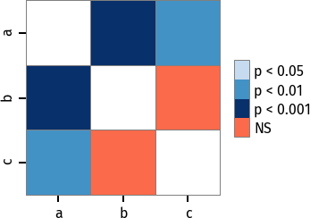

Examples
========

List or NumPy array
~~~~~~~~~~~~~~~~~~~

.. code:: python

  import scikit_posthocs as sp
  x = [[1,2,3,5,1], [12,31,54], [10,12,6,74,11]]
  sp.posthoc_conover(x, p_adjust = 'holm')

::

  array([[-1.        ,  0.00119517,  0.00278329],
         [ 0.00119517, -1.        ,  0.18672227],
         [ 0.00278329,  0.18672227, -1.        ]])

Pandas DataFrame
~~~~~~~~~~~~~~~~

Columns specified with ``val_col`` and ``group_col`` args must be melted prior to making comparisons.

.. code:: python

  import scikit_posthocs as sp
  import pandas as pd
  x = pd.DataFrame({"a": [1,2,3,5,1], "b": [12,31,54,62,12], "c": [10,12,6,74,11]})
  x = x.melt(var_name='groups', value_name='values')

::

     groups  values
  0       a       1
  1       a       2
  2       a       3
  3       a       5
  4       a       1
  5       b      12
  6       b      31
  7       b      54
  8       b      62
  9       b      12
  10      c      10
  11      c      12
  12      c       6
  13      c      74
  14      c      11

Now we may run the test.

.. code:: python

  sp.posthoc_conover(x, val_col='values', group_col='groups', p_adjust = 'fdr_bh')

::

            a         b         c
  a -1.000000  0.000328  0.002780
  b  0.000328 -1.000000  0.121659
  c  0.002780  0.121659 -1.000000

Significance plots
~~~~~~~~~~~~~~~~~~

P values can be plotted using a heatmap:

.. code:: python

  pc = sp.posthoc_conover(x, val_col='values', group_col='groups')
  heatmap_args = {'linewidths': 0.25, 'linecolor': '0.5', 'clip_on': False, 'square': True, 'cbar_ax_bbox': [0.80, 0.35, 0.04, 0.3]}
  sp.sign_plot(pc, **heatmap_args)

.. image:: _static/plot-conover.png

Custom colormap applied to a plot:

.. code:: python

  pc = sp.posthoc_conover(x, val_col='values', group_col='groups')
  # Format: diagonal, non-significant, p<0.001, p<0.01, p<0.05
  cmap = ['1', '#fb6a4a',  '#08306b',  '#4292c6', '#c6dbef']
  heatmap_args = {'cmap': cmap, 'linewidths': 0.25, 'linecolor': '0.5', 'clip_on': False, 'square': True, 'cbar_ax_bbox': [0.80, 0.35, 0.04, 0.3]}
  sp.sign_plot(pc, **heatmap_args)

