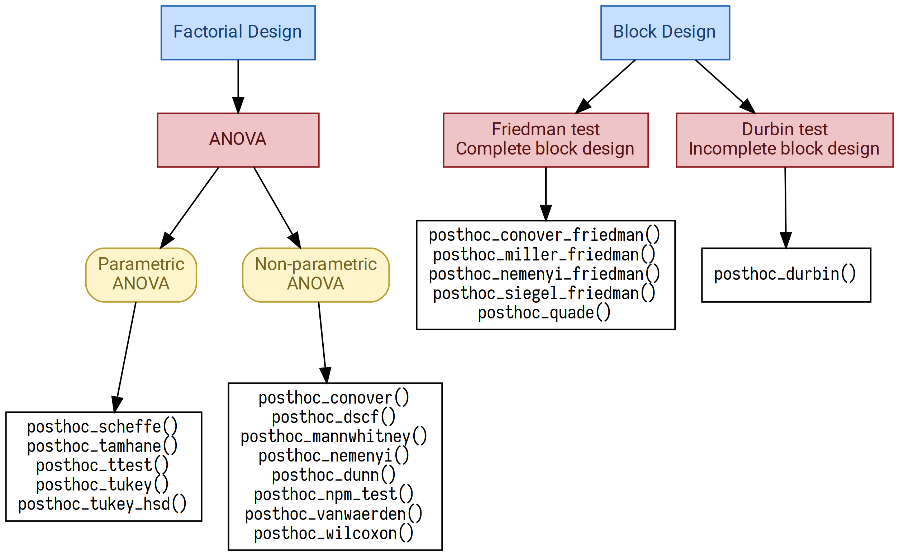

Background
==========

Python statistical ecosystem is comprised of multiple packages. However, it still has numerous gaps and is surpassed by R packages and capabilities.

`SciPy <https://www.scipy.org/>`_ (version 1.2.0) offers *Student*, *Wilcoxon*, and *Mann-Whitney* tests which are not adapted to multiple pairwise comparisons. `Statsmodels <http://statsmodels.sourceforge.net/>`_ (version 0.9.0) features *TukeyHSD* test which needs some extra actions to be fluently integrated into a data analysis pipeline. `Statsmodels <http://statsmodels.sourceforge.net/>`_ also has good helper methods: ``allpairtest`` (adapts an external function such as ``scipy.stats.ttest_ind`` to multiple pairwise comparisons) and ``multipletests`` (adjusts *p* values to minimize type I and II errors). `PMCMRplus <https://rdrr.io/cran/PMCMRplus/>`_ is a very good R package which has no rivals in Python as it offers more than 40 various tests (including post hoc tests) for factorial and block design data. PMCMRplus was an inspiration and a reference for *scikit-posthocs*.

*scikit-posthocs* attempts to improve Python statistical capabilities by offering a lot of parametric and nonparametric post hoc tests along with outliers detection and basic plotting methods.

Features
--------

- *Parametric* pairwise multiple comparisons tests:

  - Scheffe test.
  - Student T test.
  - Tamhane T2 test.
  - TukeyHSD test.

- *Non-parametric* tests for factorial design:

  - Conover test.
  - Dunn test.
  - Dwass, Steel, Critchlow, and Fligner test.
  - Mann-Whitney test.
  - Nashimoto and Wright (NPM) test.
  - Nemenyi test.
  - van Waerden test.
  - Wilcoxon test.

- *Non-parametric* tests for block design:

  - Conover test.
  - Durbin and Conover test.
  - Miller test.
  - Nemenyi test.
  - Quade test.
  - Siegel test.

- Other tests:

  - Anderson-Darling test.
  - Mack-Wolfe test.
  - Hayter (OSRT) test.

- Outliers detection tests:

  - Simple test based on interquartile range (IQR).
  - Grubbs test.
  - Tietjen-Moore test.
  - Generalized Extreme Studentized Deviate test (ESD test).

- Plotting functionality (e.g. significance plots).

All post hoc tests are capable of p adjustments for multiple pairwise comparisons.
