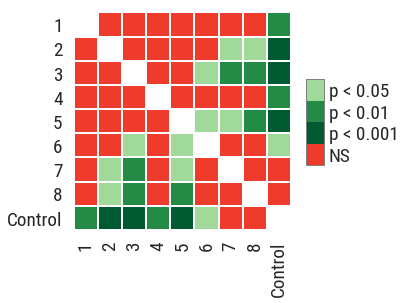

# Summary

``scikit-posthocs`` is a Python package providing multiple pairwise comparison tests (post hocs). Statisticians, data scientists and researchers can use it in a statistical analysis routine to assess the differences between group levels if a statistically significant result of a parametric or nonparametric analysis of variance (ANOVA) test has been obtained.

Most statistical software packages (such as SPSS and Stata) provide a number of post hoc tests. However, Python ecosystem still lacks implementation of these tests for factorial and block design data. Currently, *Student*, *Wilcoxon*, *Mann-Whitney* tests which are not adapted to multiple pairwise comparisons are offered by **SciPy**. **Statsmodels** package includes *TukeyHSD* test which needs extra actions to be fluently integrated into a data analysis pipeline. ``scikit-posthocs`` package is aimed at filling this gap by providing a number of nonparametric and parametric pairwise comparisons tests as well as outliers detection algorithms implemented in Python.

Currently, the following post hoc tests are implemented in this package:

1. Conover, Dunn, and Nemenyi tests (for use with Kruskal-Wallis test).
2. Conover, Nemenyi, Siegel, and Miller tests (for use with Friedman test).
3. Quade, van Waerden, Durbin, Student, Mann-Whitney, Wilcoxon, TukeyHSD, Anderson-Darling, Mack-Wolfe, Nashimoto and Wright (NPM), Scheffe, and Tamhane T2 tests.

``scikit-posthocs`` provides tests for outliers detection: interquartile range (IQR) test, Grubbs test, Tietjen-Moore test, and generalized (extreme Studentized deviate) ESD test. It also has plotting functionality to present the results of pairwise comparisons as a heatmap (significance plot, see figure).

``scikit-posthocs`` is compatible with Python 2 and 3 versions, relies heavily and extends the functionality of ``statsmodels``, ``SciPy`` and ``PMCMRplus`` packages [@Seabold2010], [@Jones2001], [@Pohlert2018]. It is also integrated with ``Pandas`` [@McKinney2010] and ``Numpy`` [@Oliphant2006] for efficient computations and data analysis. The package is fully documented and comes with a Jupyter notebook example.

# References
